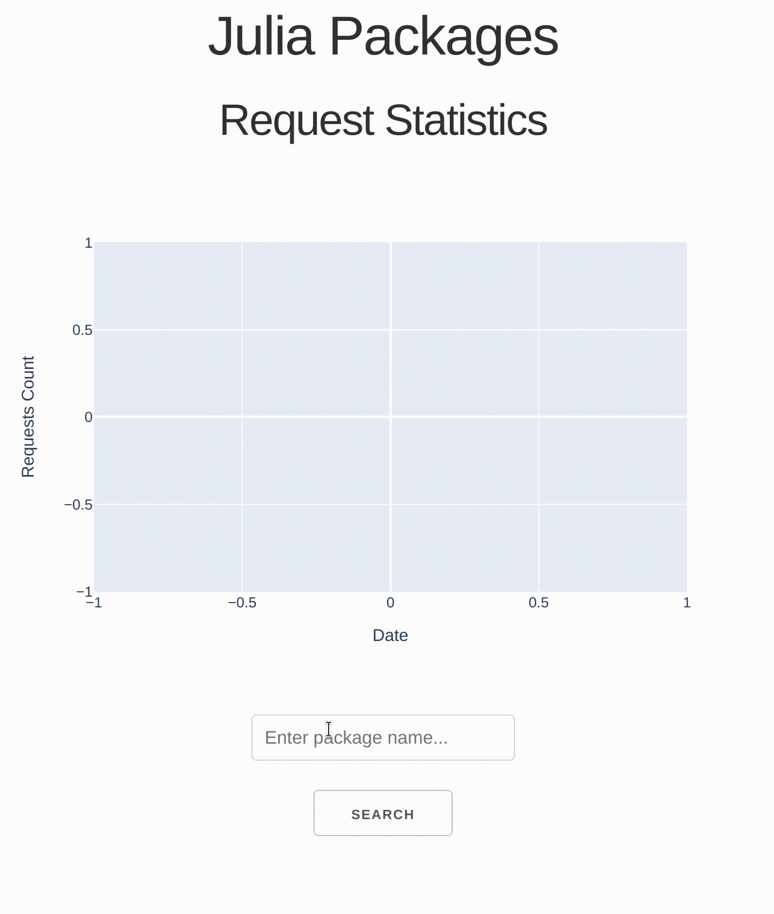

# JuliaPackages.jl

This Julia-Dash App produces graphs of the request statistics for Julia Packages. It uses the [data warehouse](https://discourse.julialang.org/t/announcing-package-download-stats/69073) by Stefan Karpinski and Elliot Saba. Many thanks to them for making the existence of this App possible.



You can run the app from the Julia REPL by typing

```
julia> using Pkg
julia> Pkg.activate(".")
julia> Pkg.instantiate()
julia> include("app.jl")
```

and then opening your browser at http://localhost:8050/
